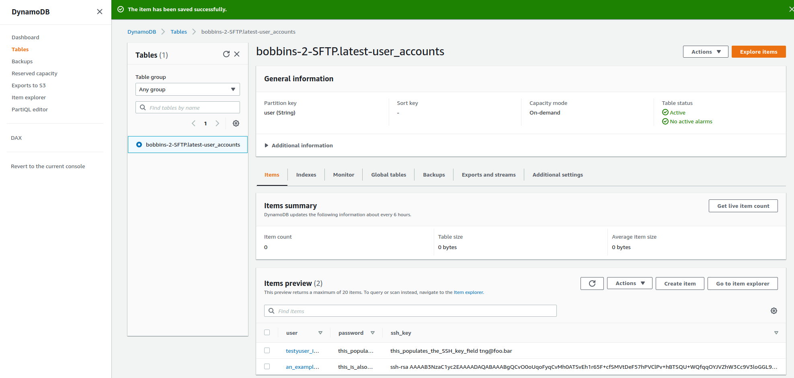

# sFTP HA Example

Build a highly available sftp service as a frontend to S3. The EC2 backends are deployed in an ASG, NLB, NAT GW, Private (default) or Public subnets.


## Pre-requisites

* You must have [Terraform](https://www.terraform.io/) installed on your computer. 
* You must have an [Amazon Web Services (AWS) account](http://aws.amazon.com/).

Configure your [AWS access 
keys](http://docs.aws.amazon.com/general/latest/gr/aws-sec-cred-types.html#access-keys-and-secret-access-keys) as 
environment variables:

```
export AWS_ACCESS_KEY_ID=(your access key id)
export AWS_SECRET_ACCESS_KEY=(your secret access key)
```

Deploy the code:

Create a file myfiles/caccount.txt which contains a file formatted as:  
```
username|password|rsakey
```

Each of these SFTP accounts will be created with either a username or key or both for example foo1 will be created with an ssh key and foo2 will be created with a password starting
d12df

```
foo1||ssh-rsa AAAAB3.....continues
foo2|d12df^d£cvik3|
```

```
terraform init
terraform apply
```

When the `apply` command completes, it will output the DNS name of the load balancer. To test the load balancer:

```
sftp foo2@<nlb_dns_name>
```

Clean up when you're done:

```
terraform destroy
```


## Instructions to add new accounts

Find the DynamoDB table created for example if the project name is bobbins-2, the DynamoDB table will be bobbins-2-SFTP.latest-user_accounts.

Create users using the Create Item button and JSON similar to the following. This example shows an account which will be created with an SSH key, the password will be ignored.

```
{
  "user": {"S": "an_example_username"},
  "password": {"S": "this_is_also_a_bad_password_changeme"},
  "ssh_key": {"S": "this SSH key will be used instead of the password. Replace with a good key"}
}
```
This example shows an account which will be created without an SSH key

```
{
  "user": {"S": "an_example_username2"},
  "password": {"S": "as_the_ssh_key_is_null_this_password_will_be_generated"},
  "ssh_key": {"S": "null"}
}
```
Adding a username with just a password:

Table of users in Dynamo DB:


## Connecting to the SFTP server:

User using an ssh key:

```
tng@jake:$ sftp an_example_username@bobbins-2-lb-a6c8d1e23d9d929a.elb.us-east-1.amazonaws.com
The authenticity of host 'bobbins-2-lb-a6c8d1e23d9d929a.elb.us-east-1.amazonaws.com (35.169.11.222)' can't be established.
ECDSA key fingerprint is SHA256:OveUwMwp+d4YR69yElnrRYDElgOzcgrHkbv4w5LWgWU.
Are you sure you want to continue connecting (yes/no/[fingerprint])? yes
Warning: Permanently added 'bobbins-2-lb-a6c8d1e23d9d929a.elb.us-east-1.amazonaws.com,35.169.11.222' (ECDSA) to the list of known hosts.
Connected to bobbins-2-lb-a6c8d1e23d9d929a.elb.us-east-1.amazonaws.com.
sftp> ls -lrt
drwxr-xr-x    2 1001     1001            6 May 22 12:00 uploads
sftp> cd uploads
sftp> put /etc/hosts
Uploading /etc/hosts to /uploads/hosts
/etc/hosts                                                                                                                                                                                                            100%  632     6.5KB/s   00:00    
```

Using a username/password:

```
tng@jake:$ sftp an_example_username3@bobbins-2-lb-a6c8d1e23d9d929a.elb.us-east-1.amazonaws.com
Warning: Permanently added the ECDSA host key for IP address '18.232.36.224' to the list of known hosts.
an_example_username3@bobbins-2-lb-a6c8d1e23d9d929a.elb.us-east-1.amazonaws.com's password: 
Connected to bobbins-2-lb-a6c8d1e23d9d929a.elb.us-east-1.amazonaws.com.
sftp> cd uploads
sftp> put /etc/hosts
Uploading /etc/hosts to /uploads/hosts
/etc/hosts                                                                                                                                                                                                            100%  632     6.5KB/s   00:00    
sftp> exit
```

## In other news

https://aws.amazon.com/blogs/aws/new-aws-transfer-for-sftp-fully-managed-sftp-service-for-amazon-s3/

https://www.squaremeal.co.uk/restaurants/sanminis_10180

I got the job!


